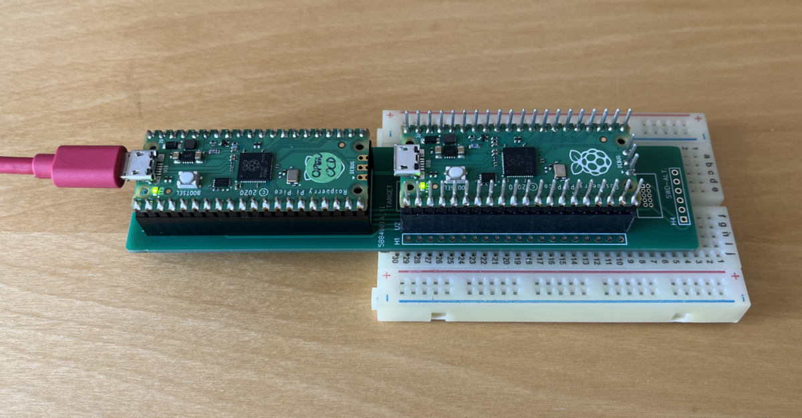

# rpi-pico-probe

By using the open source `Picoprobe` software (https://github.com/raspberrypi/picoprobe) 
it is possible to transform a low-cost RP2040 evaluation board into a USB -> SWD 
and UART bridge.

This can be combined with the free `OpenOCD` software to integrate full 
in-curcuit debugging capabilities into your preffered development environment.

Only 4 wires are required (except for VCC and GND) between the RP2040 probe 
(debugger) and the DUT (target).

Many projects online are using simple breadboard solutions in their designs 
like below.

The problem is that the solution has long floating wires that are susceptible 
to noise and have a rather poor mechanical connectivity.

Also it can be non-trivial to debug directly in a final product, and the setup 
becomes a bit bulky.

Solutions to the problem do exist - like this nice project from Fabien-Chouteau 
(https://github.com/Fabien-Chouteau/picoprobe-pcb).

However the solution still requires dangling wires between the probe and the 
target.

Another approach is the "Raspberry Pi Debug Probe" from the raspberry pi 
foundation (https://www.raspberrypi.com/products/debug-probe/). This solution 
is using custom hardware for debugging (which also can be fine), but the goal 
here is to use a standard raspberry pi pico as the probe and re-use it for 
other purposes if needed.

## Preliminary setup (breadboard)

Before making any hardware layout a test on a breadboard was made to check the 
solution.

Below are the breadboard solution.

## Solution

2 solutions was made.

The first one is called `rpi-pico-probe`, and is more a less a "copy" of what 
was made on the breadboard (just without all the dangling wires). It is made of 
through-hole components only, making it easy to solder and easy to use on a 
breadboard or in a circuit board with a socket solution.

The second solution is called `rpi-pico-probe-mini`. Here the focus has been 
to reduce the footprint, but still have the option to debug on a bread- or 
circuit-board. Here the probe is placed on the bottom side of the PCB, and all 
headers are SMT components. It is a bit harder to solder, and it is a good idea 
to start soldering the SMT componets first.

On both solutions the SWD output from the `DEBUG-PROBE` is available either 
as a real SWD 10 pin header (more or less conforming with ARM's standard 
inteface: https://developer.arm.com/documentation/101636/0100/Debug-and-Trace/JTAG-SWD-Interface)
and a custom 6 pin header for easy access to breadboards or eval-boards from
other manufacturers (like ST, Microchip, TI etc).

### rpi-pico-probe (2d and 3d)

 

 

### rpi-pico-probe-mini (2d and 3d)

 

 

## Usage

### Produced boards (raw)

Below are pictures of the produced boards.

### Mounting options

Both boards can be mounted with a minimum of components, and both have the same
options to expand with headers for breadboard testing.

To power and debug connect the `DEBUG-PROBE` device to the pc via USB.

It is optional to connect `TARGET` to a PC via USB. This might be needed in case
you troubleshoot some USB device driver (like HID, USB<->UART or mass storage 
device drivers).

Below are shown examples of mounted (and working) boards.

**rpi-pico-probe**

**rpi-pico-probe-mini**

### Use the Picoprobe software

Before the `DEBUG-PROBE` device can be used for debugging, it has to be updated
with the open source `Picoprobe` firmware.

Also, a special version of the `OpenOCD` software has to be build and used to
be able to debug (since the `Picoprobe` software is not supported in the 
official version of `OpenOCD`).

A full guide to update and used the `Picoprobe` and `OpenOCD` from vscode 
is found here: https://github.com/thucon/rpi-pico-debug

## Links

* `Picoprobe` firmware: https://github.com/raspberrypi/picoprobe